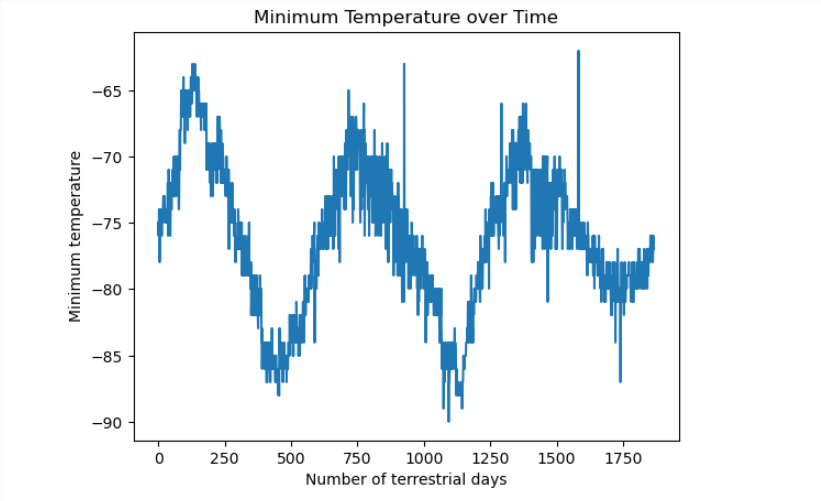

# Scrape And Analyze

## Website: 
[website](https://github.com/Damiomo/Scrape-and-Analyze)

## Description
We collect Mars data from multiple websites and then analyze the information collected.

## Table of Contents
- [Installation](#installation)
- [Usage](#usage)
- [Credits](#credits)
- [License](#license)
- [Features](#features)

- [Contact](#contact)

## Installation
python, pandas, requests, beutifulSoup

## Usage
run the ipynb files

## Credits
Damilare Omoboriowo

## License
MIT

## Features
It provides an analysis of the Mars data collected.

## Contact
If there are any questions or concerns, I can be reached at:
##### [github: Damiomo](https://github.com/Damiomo)
##### [email: Domoboriowo14@Gmail.com](mailto:Domoboriowo14@Gmail.com)
